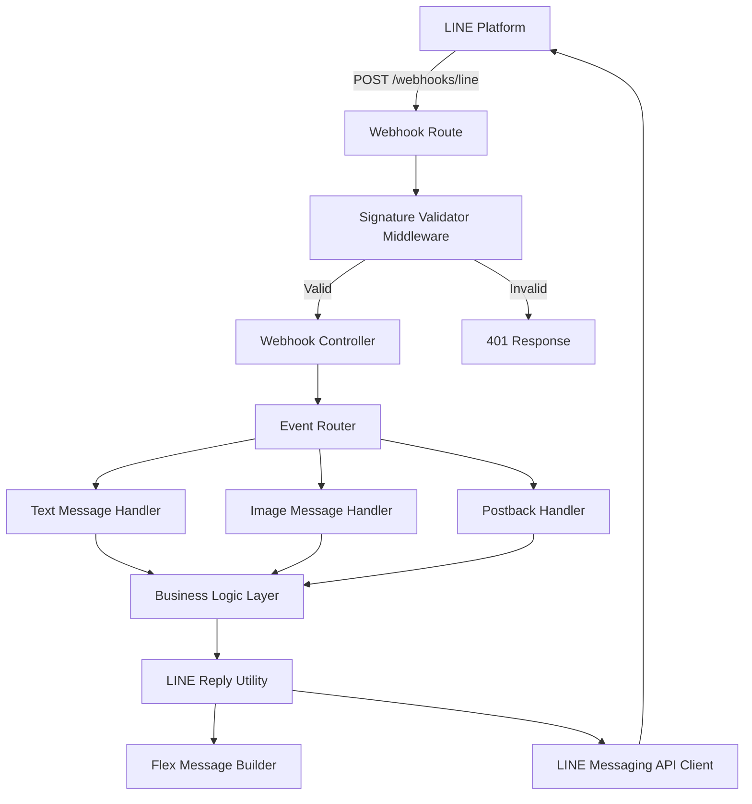

# LINE Webhook Handler Design Document

## Overview

This design implements a LINE Messaging API webhook handler that processes incoming events (text messages, image messages, and postback events) and provides reusable utilities for building flex messages and replying to users. The implementation follows the existing 3-layer architecture pattern and DRY principles.

## Architecture

### High-Level Flow

```
LINE Platform → Webhook Endpoint → Signature Validation → Event Router → Event Handlers → Business Logic → Reply Utility → LINE Platform
```

### Component Diagram



## Components and Interfaces

### 1. Configuration Extension

Extend the existing configuration to include LINE credentials:

```typescript
// api/src/core/config/index.ts
export const config = {
  // ... existing config
  line: {
    channelAccessToken: process.env.LINE_CHANNEL_ACCESS_TOKEN || '',
    channelSecret: process.env.LINE_CHANNEL_SECRET || '',
    messagingApiUrl: 'https://api.line.me/v2/bot',
  },
};
```

### 2. LINE Types and Interfaces

```typescript
// api/src/features/line/line.types.ts

export interface LineWebhookBody {
  destination: string;
  events: LineEvent[];
}

export type LineEvent = 
  | LineMessageEvent 
  | LinePostbackEvent 
  | LineFollowEvent 
  | LineUnfollowEvent;

export interface BaseLineEvent {
  type: string;
  timestamp: number;
  source: LineEventSource;
  replyToken: string;
  mode: 'active' | 'standby';
}

export interface LineEventSource {
  type: 'user' | 'group' | 'room';
  userId: string;
  groupId?: string;
  roomId?: string;
}

export interface LineMessageEvent extends BaseLineEvent {
  type: 'message';
  message: LineMessage;
}

export type LineMessage = 
  | LineTextMessage 
  | LineImageMessage 
  | LineStickerMessage;

export interface LineTextMessage {
  type: 'text';
  id: string;
  text: string;
}

export interface LineImageMessage {
  type: 'image';
  id: string;
  contentProvider: {
    type: 'line' | 'external';
    originalContentUrl?: string;
    previewImageUrl?: string;
  };
}

export interface LinePostbackEvent extends BaseLineEvent {
  type: 'postback';
  postback: {
    data: string;
    params?: Record<string, any>;
  };
}

export interface LineReplyMessage {
  type: 'text' | 'flex' | 'template' | 'image';
  text?: string;
  altText?: string;
  contents?: FlexMessage;
  [key: string]: any;
}

export interface FlexMessage {
  type: 'bubble' | 'carousel';
  hero?: FlexComponent;
  header?: FlexBox;
  body?: FlexBox;
  footer?: FlexBox;
  styles?: FlexStyles;
}

export interface FlexBox {
  type: 'box';
  layout: 'horizontal' | 'vertical' | 'baseline';
  contents: FlexComponent[];
  spacing?: string;
  margin?: string;
  paddingAll?: string;
}

export interface FlexComponent {
  type: 'text' | 'button' | 'image' | 'separator' | 'spacer' | 'box';
  [key: string]: any;
}

export interface PostbackData {
  action: string;
  params?: Record<string, any>;
}
```

### 3. LINE Messaging API Client

```typescript
// api/src/features/line/line.client.ts

export class LineMessagingClient {
  constructor(
    private accessToken: string,
    private apiUrl: string
  );

  async replyMessage(
    replyToken: string,
    messages: LineReplyMessage[]
  ): Promise<void>;

  async getMessageContent(messageId: string): Promise<Buffer>;

  async pushMessage(
    to: string,
    messages: LineReplyMessage[]
  ): Promise<void>;
}
```

### 4. Signature Validation Middleware

```typescript
// api/src/middleware/line-signature.middleware.ts

export const validateLineSignature = () => {
  return async (c: Context, next: Next) => {
    const signature = c.req.header('x-line-signature');
    const body = await c.req.text();
    
    // Validate signature using HMAC-SHA256
    // If invalid, return 401
    // If valid, parse body and attach to context
    
    await next();
  };
};
```

### 5. Event Router (Strategy Pattern)

```typescript
// api/src/features/line/line.router.ts

export interface EventHandler {
  canHandle(event: LineEvent): boolean;
  handle(event: LineEvent, context: EventContext): Promise<void>;
}

export class LineEventRouter {
  private handlers: EventHandler[] = [];

  registerHandler(handler: EventHandler): void;
  
  async routeEvent(event: LineEvent, context: EventContext): Promise<void>;
}
```

### 6. Event Handlers

```typescript
// api/src/features/line/handlers/text-message.handler.ts
export class TextMessageHandler implements EventHandler {
  canHandle(event: LineEvent): boolean;
  async handle(event: LineMessageEvent, context: EventContext): Promise<void>;
}

// api/src/features/line/handlers/image-message.handler.ts
export class ImageMessageHandler implements EventHandler {
  canHandle(event: LineEvent): boolean;
  async handle(event: LineMessageEvent, context: EventContext): Promise<void>;
}

// api/src/features/line/handlers/postback.handler.ts
export class PostbackHandler implements EventHandler {
  canHandle(event: LineEvent): boolean;
  async handle(event: LinePostbackEvent, context: EventContext): Promise<void>;
}
```

### 7. Flex Message Builder Utility

```typescript
// api/src/features/line/utils/flex-message.builder.ts

export class FlexMessageBuilder {
  private message: FlexMessage;

  static createBubble(): FlexMessageBuilder;
  
  setHeader(contents: FlexComponent[]): FlexMessageBuilder;
  
  setBody(contents: FlexComponent[]): FlexMessageBuilder;
  
  setFooter(contents: FlexComponent[]): FlexMessageBuilder;
  
  addText(
    text: string,
    options?: {
      size?: 'xxs' | 'xs' | 'sm' | 'md' | 'lg' | 'xl' | 'xxl';
      weight?: 'regular' | 'bold';
      color?: string;
      wrap?: boolean;
    }
  ): FlexComponent;
  
  addButton(
    label: string,
    action: {
      type: 'postback' | 'uri' | 'message';
      data?: string;
      uri?: string;
      text?: string;
    },
    options?: {
      style?: 'primary' | 'secondary' | 'link';
      color?: string;
    }
  ): FlexComponent;
  
  addImage(
    url: string,
    options?: {
      size?: string;
      aspectRatio?: string;
      aspectMode?: 'cover' | 'fit';
    }
  ): FlexComponent;
  
  addSeparator(): FlexComponent;
  
  addSpacer(size?: 'xs' | 'sm' | 'md' | 'lg' | 'xl'): FlexComponent;
  
  createBox(
    layout: 'horizontal' | 'vertical' | 'baseline',
    contents: FlexComponent[]
  ): FlexBox;
  
  build(): FlexMessage;
}
```

### 8. Reply Utility

```typescript
// api/src/features/line/utils/line-reply.util.ts

export class LineReplyUtil {
  constructor(private client: LineMessagingClient);

  async replyText(
    replyToken: string,
    text: string
  ): Promise<void>;

  async replyFlex(
    replyToken: string,
    altText: string,
    flexMessage: FlexMessage
  ): Promise<void>;

  async replyMessages(
    replyToken: string,
    messages: LineReplyMessage[]
  ): Promise<void>;
}
```

### 9. Domain Layer

```typescript
// api/src/features/line/line.domain.ts

export class LineDomain {
  constructor(
    private client: LineMessagingClient,
    private replyUtil: LineReplyUtil,
    private eventRouter: LineEventRouter
  );

  async processWebhook(webhookBody: LineWebhookBody): Promise<void>;
  
  async handleTextMessage(
    event: LineMessageEvent,
    replyToken: string
  ): Promise<void>;
  
  async handleImageMessage(
    event: LineMessageEvent,
    replyToken: string
  ): Promise<void>;
  
  async handlePostback(
    event: LinePostbackEvent,
    replyToken: string
  ): Promise<void>;
}
```

### 10. Route Controller

```typescript
// api/src/routes/line.routes.ts

export const lineRoutes = new Hono();

lineRoutes.post(
  '/webhook',
  validateLineSignature(),
  async (c) => {
    const webhookBody = c.get('lineWebhookBody');
    // Process webhook
    return c.json({ success: true }, 200);
  }
);
```

## Data Models

### Environment Variables

```env
LINE_CHANNEL_ACCESS_TOKEN=your_channel_access_token
LINE_CHANNEL_SECRET=your_channel_secret
```

### Postback Data Format

Postback data will be structured as JSON strings:

```json
{
  "action": "view_loan_details",
  "params": {
    "loanId": "uuid-here",
    "clientId": "uuid-here"
  }
}
```

### Example Flex Message Structure

```json
{
  "type": "bubble",
  "header": {
    "type": "box",
    "layout": "vertical",
    "contents": [
      {
        "type": "text",
        "text": "Loan Details",
        "weight": "bold",
        "size": "xl"
      }
    ]
  },
  "body": {
    "type": "box",
    "layout": "vertical",
    "contents": [
      {
        "type": "text",
        "text": "Principal: ฿50,000",
        "size": "md"
      }
    ]
  },
  "footer": {
    "type": "box",
    "layout": "vertical",
    "contents": [
      {
        "type": "button",
        "action": {
          "type": "postback",
          "label": "Make Payment",
          "data": "{\"action\":\"make_payment\",\"params\":{\"loanId\":\"123\"}}"
        },
        "style": "primary"
      }
    ]
  }
}
```

## Error Handling

### Custom LINE Errors

```typescript
// api/src/features/line/line.errors.ts

export class LineApiError extends AppError {
  constructor(message: string, lineErrorCode?: string, details?: any) {
    super(message, 500, 'LINE_API_ERROR', details);
  }
}

export class LineSignatureError extends AppError {
  constructor() {
    super('Invalid LINE signature', 401, 'INVALID_LINE_SIGNATURE');
  }
}

export class LineMessageError extends AppError {
  constructor(message: string, details?: any) {
    super(message, 400, 'LINE_MESSAGE_ERROR', details);
  }
}
```

### Error Handling Strategy

1. **Signature Validation Errors**: Return 401 immediately, log the attempt
2. **LINE API Errors**: Log error, attempt to send fallback message to user
3. **Event Processing Errors**: Log error, send generic error message to user
4. **Image Download Errors**: Log error, notify user that image couldn't be processed
5. **Postback Parsing Errors**: Log error, send "Invalid action" message to user

### Fallback Messages

```typescript
const FALLBACK_MESSAGES = {
  GENERAL_ERROR: 'ขออภัย เกิดข้อผิดพลาด กรุณาลองใหม่อีกครั้ง',
  IMAGE_ERROR: 'ไม่สามารถประมวลผลรูปภาพได้ กรุณาลองใหม่',
  INVALID_ACTION: 'คำสั่งไม่ถูกต้อง กรุณาเลือกใหม่',
};
```

## Testing Strategy

### Unit Tests

1. **Signature Validation**
   - Test valid signature passes
   - Test invalid signature fails
   - Test missing signature fails

2. **Event Router**
   - Test correct handler is selected for each event type
   - Test unknown event types are handled gracefully

3. **Flex Message Builder**
   - Test building complete flex messages
   - Test each component type (text, button, image)
   - Test validation of required fields

4. **Reply Utility**
   - Test text message replies
   - Test flex message replies
   - Test error handling for API failures

5. **Event Handlers**
   - Test text message processing
   - Test image message processing
   - Test postback data parsing

### Integration Tests

1. **Webhook Endpoint**
   - Test complete webhook flow with valid signature
   - Test webhook rejection with invalid signature
   - Test processing multiple events in one request

2. **LINE API Client**
   - Test reply message API calls
   - Test get message content API calls
   - Test error responses from LINE API

### Mock Data

Create mock LINE webhook payloads for testing:

```typescript
// Test fixtures
const mockTextMessageEvent = { /* ... */ };
const mockImageMessageEvent = { /* ... */ };
const mockPostbackEvent = { /* ... */ };
```

## Security Considerations

1. **Signature Validation**: Always validate X-Line-Signature header using HMAC-SHA256
2. **Token Security**: Store LINE_CHANNEL_ACCESS_TOKEN securely, never expose in logs
3. **Input Validation**: Validate all postback data before processing
4. **Rate Limiting**: Consider implementing rate limiting on webhook endpoint
5. **Content Validation**: Validate image size and type before processing
6. **Error Messages**: Don't expose internal errors to LINE users

## Performance Considerations

1. **Async Processing**: Process events asynchronously to respond to LINE within 3 seconds
2. **Image Caching**: Consider caching downloaded images if needed multiple times
3. **Connection Pooling**: Reuse HTTP connections for LINE API calls
4. **Logging**: Use appropriate log levels to avoid performance impact
5. **Batch Processing**: Process multiple events in a webhook efficiently

## Integration Points

### With Existing Features

1. **Clients Feature**: Link LINE user IDs to client records
2. **Loans Feature**: Display loan information via flex messages
3. **Authentication**: Verify LINE user identity for sensitive operations
4. **Logging**: Use existing Pino logger for all LINE-related logs

### External Dependencies

1. **LINE Messaging API**: For sending/receiving messages
2. **LINE Content API**: For downloading image content

## Implementation Notes

1. Use existing `logger` from `api/src/core/logger`
2. Follow existing error handling patterns with `AppError`
3. Use Zod for validating webhook payloads
4. Implement dependency injection for testability
5. Keep business logic separate from LINE-specific code
6. Use TypeScript strict mode for type safety
7. Follow the existing 3-layer architecture (routes → domain → repository)
